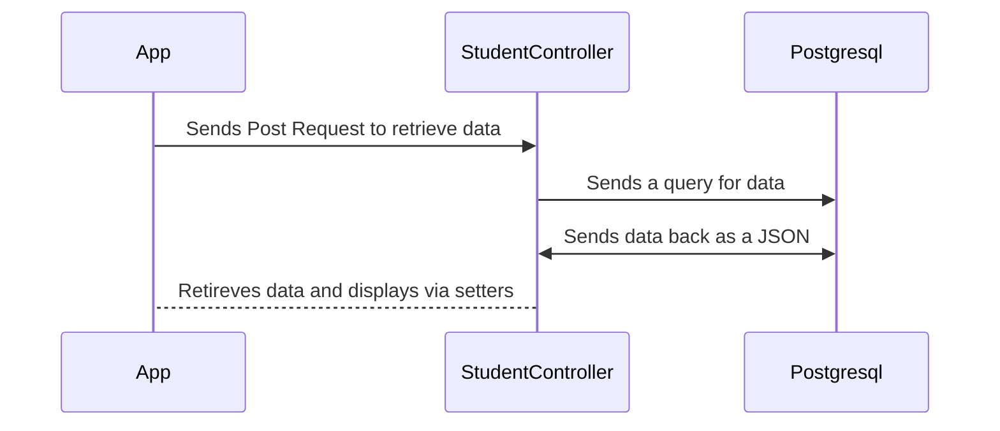
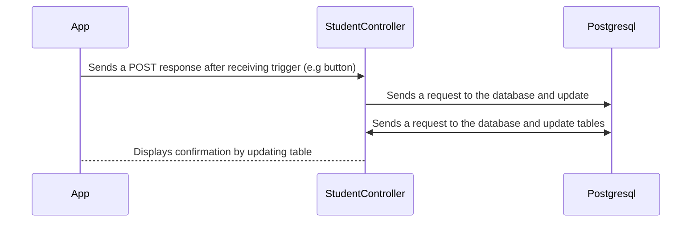

# Full connection Guide

## Fetch (GET)

### Startup is required
So this is when the frontend ([See Frontend Startup ](./startup-springboot.md)) and backend is on ([See Backend Startup](./startup-backend.md))

### Description 
This is the process for getting data from the database 
#### High level flow
1) fetch: `http://localhost:8080/api/students`
   2) This will send a `GET` request to the database via the backend
2) Goes to backend `StudentsController.java`
   3) The `GET` request will be processed through the [StudentsController](../../backend/src/main/java/com/example/full_connection/Controller/StudentsController.java)
3) Queries database
   4) This will then go into the database where it will query and return the data requested

#### Diagram 

## Post (POST) 
### Description
This is the process for posting new data to the database

#### High Level Flow
1) User interacts with the UI
2) Triggers `handleSubmit` function
   3) This creates a fetch request, specifcally a  `POST`, to the backend as a JSON
      4) via `http://localhost:8080/api/students`
5) Send the request via the `StudentController`
6) Saves data within respected tables

#### Diagram

